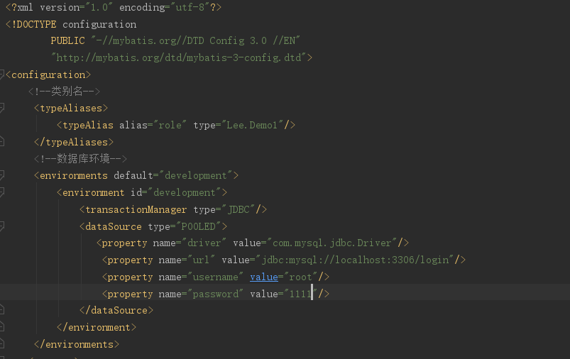

### 使用Mybatis首先是去生产SqlSessionFactory，可以通过读取配置文件XML的形式生成,也可以通过java代码的形式去生成
>SqlSessionFactory是一个接口,在MyBatis中它存在两个实现类:SqlSesionManager和DefaultSqlSessionFactory。一般而言,具体是由DefalutSqlSessionFactory去实现而SqlSession使用在多线程的环境中,它的具体实现依靠DefaultSqlSessionFactory。
- SqlSessionFactory唯一的作用就是生产Mybatis的核心接口对象SqlSession，责任唯一，往往采用单例模式处理
### 使用XML构建SqlSessionFactory
#### 分类
- 基础配置文件：通常只有一个，主要是配置一些最基本的上下文参数和运行环境
- 映射文件：配置映射关系、SQL、参数等信息
### 基础配置文件

